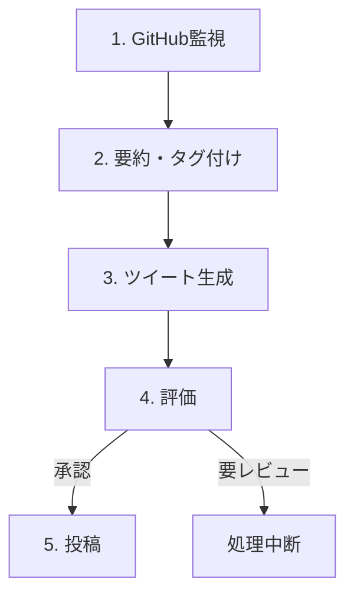

# チームみらい政策リポジトリ更新通知Bot

このプロジェクトは、政党「チームみらい」がGitHubで管理する政策リポジトリの更新内容を自動で取得・要約し、Twitter (X) で発信するマルチエージェントシステムです。

## 概要

日々の政策更新を分かりやすく要約し、Twitterで発信することで、政策決定プロセスの透明性を高め、有権者や支持者がその動向を追いやすくすることを目的としています。

## システム構成 (フェーズ1: MVP)

本システムはLangGraphをベースとしたマルチエージェントシステムとして構築されており、フェーズ1では以下のエージェントが連携して動作します。



## 機能詳細

### GitHub監視エージェント
- **取得対象:** 対象リポジトリ (`team-mirai/policy`) において、**過去24時間以内**にマージされたPull Requestを取得します。
- **目的:** 日次で実行されることを想定し、前日分の主要な更新を網羅します。

### 要約・タグ付けエージェント
- GitHubから取得したPull Requestの本文を元に、LLM (Gemini) を使用して要約と関連タグを生成します。
- 高品質な要約のため、詳細なプロンプト設計が施されています。

### ツイート生成エージェント
- 個別の要約を素材として、LLM (Gemini) が「編集長」として機能し、Twitter (X) への投稿に適したツイート文案を生成します。
- フェーズ1では、以下の2連投ツイートを生成します。
    - **1ツイート目 (ヘッドライン):** 全ての更新の要点を網羅的に紹介。
    - **2ツイート目 (深掘り解説):** 最も重要と判断された更新について、その背景や意義を詳しく解説。

### 評価エージェント
- 生成されたツイート文案が公開に適しているか、LLM (Gemini) が多角的な観点から評価します。
- 不適切な内容や誤解を招く可能性のあるツイートは、自動投稿を中断し、人間のレビューを促します。

### 投稿エージェント
- 評価エージェントによって承認されたツイート文案を、Twitter (X) へ投稿します。
- **現在の実装では、Twitter APIへの実際の投稿は行わず、コンソールにツイート内容を表示するシミュレーションモードで動作します。**

## 環境構築と実行

### 必要な環境変数
本システムを実行するには、以下の環境変数を設定する必要があります。

- `GITHUB_API_TOKEN`
    - **用途:** GitHub APIからPull Requestの情報を取得するために使用します。
    - **取得方法:** GitHubの「Settings」→「Developer settings」→「Personal access tokens」で、`repo`スコープ（またはリポジトリへの読み取り権限）を持つトークンを生成してください。
    - **設定例 (Bash/Zsh):** `export GITHUB_API_TOKEN="ghp_YOUR_GITHUB_TOKEN_HERE"`

- `GEMINI_API_KEY`
    - **用途:** Gemini API (LLM) を利用して、要約、タグ付け、ツイート生成、評価を行うために使用します。
    - **取得方法:** Google AI Studio (https://aistudio.google.com/app/apikey) でAPIキーを生成してください。
    - **設定例 (Bash/Zsh):** `export GEMINI_API_KEY="AIzaSy...YOUR_GEMINI_API_KEY_HERE"`

### 仮想環境の構築と有効化

```bash
python3 -m venv venv
source venv/bin/activate
```

### 依存関係のインストール

```bash
pip install -r requirements.txt
```

### 実行方法

環境変数を設定し、依存関係をインストールした後、以下のコマンドでシステムを実行できます。

- **過去24時間以内の更新を取得する場合:**
```bash
python src/main.py
```

- **特定の日付の更新を取得する場合 (例: 2025年7月19日):**
```bash
python src/main.py 2025-07-19
```

## 開発フェーズ

本プロジェクトは段階的に開発を進めています。現在のフェーズ1 (MVP) の詳細については、`requirements.md` を参照してください。
