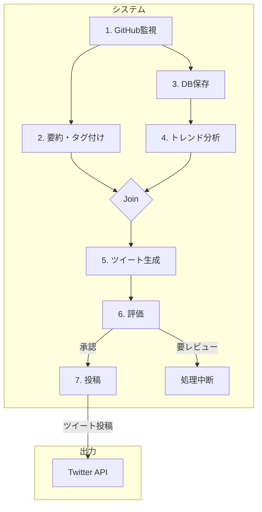

# 「チームみらい」政策リポジトリ更新通知Bot 要件定義書

## 1. 概要

本ドキュメントは、政党「チームみらい」がGitHubで管理する政策リポジトリ (`team-mirai/policy`) の更新情報を自動で取得・要約し、Twitterで発信するBotシステムの要件を定義するものである。

## 2. システムの目的

- **透明性の向上:** 政策決定プロセスの可視化により、党の活動に対する有権者・支持者の理解を促進する。
- **情報発信の効率化:** 日々の更新内容の要約と投稿を自動化し、情報発信の運用コストを削減する。
- **関心の喚起:** 政策の更新内容に加え、活動のトレンドを分析・提示することで、より深い関心を喚起する。

## 3. システム構成

本システムは、役割ごとに独立したエージェントで構成されるマルチエージェントシステムとして構築する。ツイート生成後、投稿前に「評価エージェント」による内容の検証ステップを設けることで、システムの信頼性と安全性を担保する。



## 4. 機能要件

本システムの各エージェント（機能部品）の仕様を以下に定義する。

| No. | エージェント名 | 役割 | 主要技術 | LLM利用 |
|:---:|:---|:---|:---|:---:|
| 1 | **GitHub監視エージェント** | 1日1回、リポジトリの更新（Issue/PR）を取得する。 | `PyGithub` | **なし** |
| 2 | **要約・タグ付けエージェント** | 取得した更新内容の要約とタグ付けを行う。 | `google-generativeai` | **あり** |
| 3 | **DB保存エージェント** | 更新情報とタグをデータベースに永続化する。 | `Supabase` | **なし** |
| 4 | **トレンド分析エージェント** | 蓄積データと過去の文脈を基に、更新の意義を分析する。 | `google-generativeai` | **あり** |
| 5 | **ツイート生成エージェント** | 全ての情報を統合し、ツイート文案を生成する。 | `google-generativeai` | **あり** |
| 6 | **評価エージェント** | 生成されたツイート文案が公開に適しているか検証する。 | `google-generativeai` | **あり** |
| 7 | **投稿エージェント** | 検証済みのツイートを実際にTwitterへ投稿する。 | `Tweepy` | **なし** |

### 4.1. GitHub監視エージェント
- (変更なし)

### 4.2. 要約・タグ付けエージェント
- (変更なし)

### 4.3. DB保存エージェント
- **入力:** 更新情報のリスト、タグのリスト
- **処理:**
    - SupabaseのPythonクライアントライブラリを使用し、ネットワーク経由で直接データベースに接続する。
    - 将来の分析のため、更新情報をデータベースに保存する。
    - 保存する主なカラム: `id`, `type (issue/pr)`, `title`, `url`, `author`, `created_at`, `tags`
- **出力:** なし（DBへの書き込み完了）

### 4.4. トレンド分析エージェント
- (変更なし)

### 4.5. ツイート生成エージェント
- **入力:** 個別の要約リスト、タグのリスト、トレンド分析コメント
- **処理:**
    - 大規模言語モデル（LLM）を「編集長」として利用し、後述の「最終アウトプット仕様」で定義された3連投ツイートの文案セットを生成する。
    - **ヘッドラインツイート(1/3):** 全ての個別要約を素材に、網羅的な概要を生成する。
    - **深掘り解説ツイート(2/3):** LLMに「変更規模」「影響範囲」等の観点から最重要の更新を選ばせ、その意義を詳述させる。
    - **トレンド分析ツイート(3/3):** 入力されたトレンド分析コメントを元に、魅力的なツイート文を生成する。
    - 更新が1件のみの場合は、ヘッドラインと深掘り解説を統合した1つのツイートのみを生成するよう、条件分岐を行う。
- **出力:** 生成されたツイート文案のリスト（最大3件）

### 4.6. 評価エージェント
- **入力:** 生成されたツイート文案のリスト
- **処理:**
    - 大規模言語モデル（LLM）を利用し、入力されたツイート文案の**リスト全体**を以下の観点で評価する。
        - **事実整合性:** 元の情報と矛盾がないか。
        - **トーンの適切性:** 客観的・中立的な表現か。
        - **安全性:** 有害・不適切な内容を含んでいないか。
        - **連携性:** 3つのツイートが連投として自然な流れになっているか。
    - 評価結果を「承認」または「要レビュー」で判定する。
- **出力:** 評価結果（文字列）、評価理由（文字列）

### 4.7. 投稿エージェント
- **入力:** 評価が「承認」されたツイート文案のリスト
- **処理:**
    - 入力されたツイート文案のリストを、Twitter APIを介して、リプライ形式で連続投稿（スレッド投稿）する。
- **出力:** なし（Twitterへの投稿完了）

## 5. 最終アウトプット仕様（ツイート構成）

本システムが最終的に生成・投稿するツイートは、以下の3連投形式を基本とする。

| ツイート | 接頭辞 | 内容 | 備考 |
| :--- | :--- | :--- | :--- |
| **1. ヘッドライン** | 【本日の政策更新】 | その日の全更新の要点を280文字以内で網羅的に紹介。「(1/3)」を付与し、続きがあることを示唆する。 | 更新が1件の場合は、このツイートに「深掘り解説」の内容を統合して完結させる。 |
| **2. 深掘り解説** | 【主要な更新】 | 最も重要と判断された更新について、その背景や意義を詳しく解説。「(2/3)」を付与する。 | 更新が1件の場合は投稿しない。 |
| **3. トレンド分析** | 【#チームみらい 活動レポート】 | DBの時系列データから分析した活動トレンドや注目ポイントを提示。「(3/3)」を付与する。 | |

| 項目 | 要件 |
|:---|:---|
| **実行環境** | GitHub Actions上で完結させる。 |
| **性能** | 全ての処理を1日1回、10分以内に完了させる。 |
| **可用性** | GitHub Actionsの稼働率に準ずる。99%以上の成功率を目指す。 |
| **セキュリティ** | GitHub, Twitter, LLMのAPIキーは、GitHub Secretsで安全に管理し、コード中にハードコーディングしない。 |
| **運用・保守** | - 各エージェントの処理開始・終了・エラー時にログを出力する。<br>- エラー発生時には、管理者が検知できる仕組みを設ける（Actionsの通知など）。 |

## 6. 技術スタック（案）

| 分類 | 技術 | 目的 |
|:---|:---|:---|
| **言語** | Python 3.x | データ処理、API連携、LLMとの親和性 |
| **実行環境** | GitHub Actions | 定期実行、CI/CD |
| **主要ライブラリ** | `PyGithub` | GitHub API操作 |
| | `Tweepy` | Twitter API操作 |
| | `google-generativeai` | LLM（Gemini） API操作 |
| **データベース** | Supabase | マネージドDBaaS (PostgreSQL) による堅牢なデータ永続化と高度なクエリ実行。<br>※将来的には、拡張機能 `pgvector` を利用したベクトル検索の導入も視野に入れる。 |

## 7. 開発フェーズ

本システムは、リスクを最小化し、迅速に価値を提供するために、以下の2段階のフェーズに分けて開発を行う。

### フェーズ1: MVP (Minimum Viable Product) の構築

- **目的:** データベースを利用せずに、日々の更新情報を取得し、2連投のツイートを生成・投稿するまでのコアなパイプラインを確立する。
- **対象エージェント:**
    - `GitHub監視エージェント`
    - `要約・タグ付けエージェント`
    - `ツイート生成エージェント`
    - `評価エージェント`
    - `投稿エージェント`
- **対象外エージェント:**
    - `DB保存エージェント`
    - `トレンド分析エージェント`
- **アウトプット:**
    - 1ツイート目: ヘッドライン要約
    - 2ツイート目: 深掘り解説
    - (トレンド分析ツイートは生成しない)
- **ワークフロー図:**
    ```mermaid
    graph TD
        A[1. GitHub監視] --> B[2. 要約・タグ付け]
        B --> F[3. ツイート生成]
        F --> G[4. 評価]
        G -- "承認" --> H[5. 投稿]
        G -- "要レビュー" --> I[処理中断]
    ```

### フェーズ2: フル機能の実装

- **目的:** データベースを導入し、過去のデータを活用した高度なトレンド分析機能を含む、全ての機能を実装する。
- **追加実装:**
    - `DB保存エージェント`と`トレンド分析エージェント`を有効化する。
    - Supabase (PostgreSQL) との連携を確立する。
    - 最終的なアウトプットを、トレンド分析を含む3連投ツイートとする。

